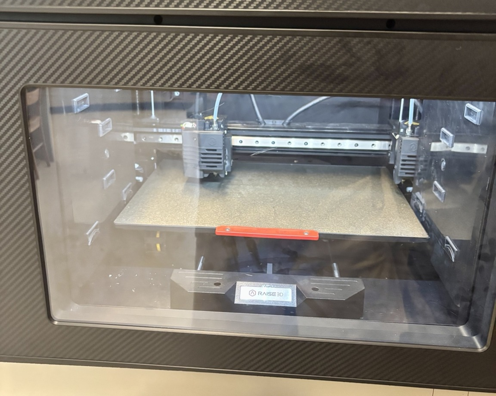

## June 12th

All parts came in. Assembed mechanical [chassis](https://github.com/marco-v9/DriveWire/blob/main/Chassis.md). 

## June 13th

Ran basic code on ESP32 board to show it is communicating properly with my computer. 

## June 14th

Soldered dual motor driver board, and wired basic powertrain circuitry. Ran code to spin a motor, and touched two wires against contacts. Confirmed by doing so that the motor will go forward, and reverse based on the code written. 

## June 29th

Soldered 22 AWG automotive wire to the motor terminals, and wrapped joints in heat shrink wrap. Zip tied cables as needed to reduce strain on joints and keep good organization. 

Also soldered the current sensor board and time of flight sensor board. Soldered jumper wires to the battery pack with heat shrink at the joint for easy connection to power source. Battery pack secured to underside of chassis for lower centre of gravity, and breadboard mounted to top of chassis with adhesive. 

Wired up the full circuit minus the ToF sensor, and created much more in depth code that allows for user input in order to test circuit function. 

Ran into an issue where there was an audible buzzing, and no motor movement when expected with input. After some tinkering, I discovered that the PWM (pulse-width modulation) set at 90 was too low to overcome static friction, and the default frequency of 1kHz was causing the motor windings to vibrate and a frequency audible to the human ear. I adjusted the PWM frequency to 140 and this solved the issue. 

I now have a bug where one motor functions perfectly as expected, but the other is not responding to any inputs. I have two dual motor driver boards, so i tested between the two. I got slightly different results, but neither perfectly drove both motors. I still have to go through some more debugging, but at this point I am suspicious of the motor driver board. 

  

# July 1 - July 3
I learned SolidWorks with the goal of 3D printing a professional demo [support stand](https://github.com/marco-v9/DriveWire/blob/main/Mechanical/Support-Stand.md) for DriveWire. I need the wheels to be suspended off the ground so that I can debug and demo properly. By July 3rd, using reference planes, sketch tools, and the rib feature, along with basic structural analysis, this is the stand that I produced: 

  

Also sliced design, and started 3D printing process using black PLA on the Raise3D E2 printer. Supports off to avoid scarring small details, and a 9 hour estimated print time. Here is the printer getting started: 

  

