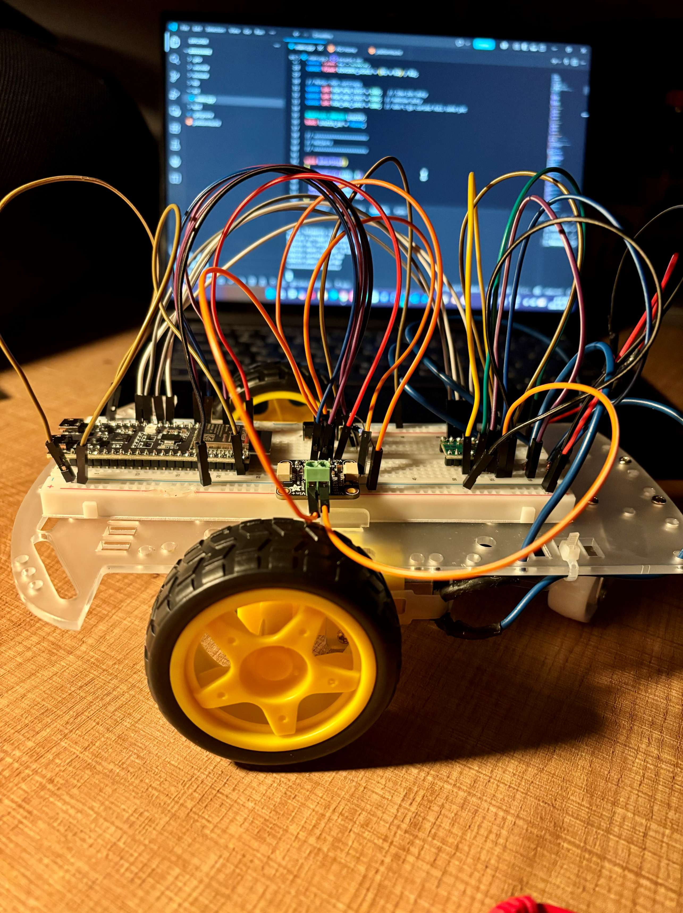
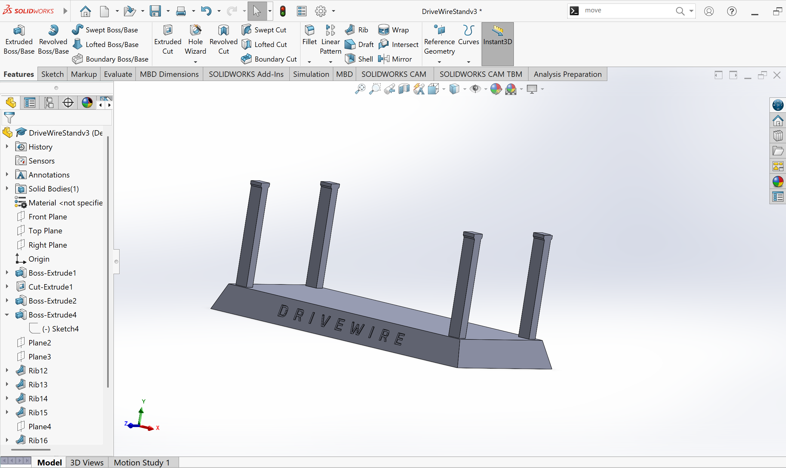
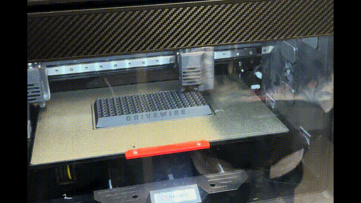
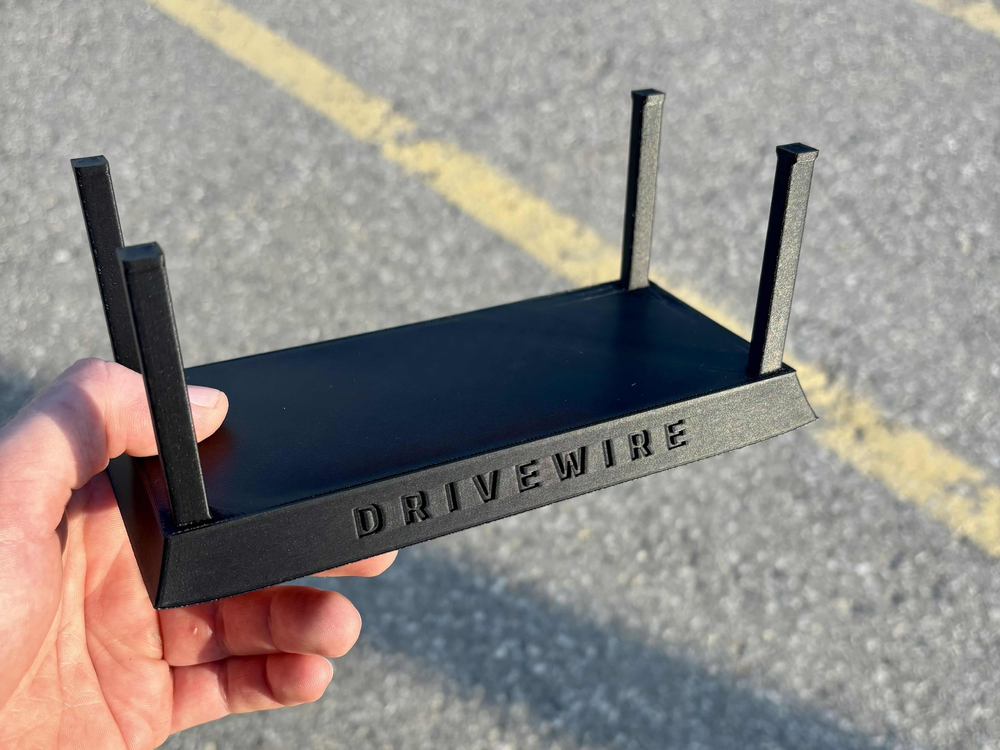

## June 12th

All parts came in. Assembled mechanical [chassis](https://github.com/marco-v9/DriveWire/blob/main/Chassis.md). 

## June 13th

Ran basic code on ESP32 board to show it is communicating properly with my computer. 

## June 14th

Soldered dual motor driver board, and wired basic powertrain circuitry. Ran code to spin a motor, and touched two wires against contacts. Confirmed by doing so that the motor will go forward, and reverse based on the code written. 

## June 29th

Soldered 22 AWG automotive wire to the motor terminals, and wrapped joints in heat shrink wrap. Zip tied cables as needed to reduce strain on joints and keep good organization. 

Also soldered the current sensor board and time of flight sensor board. Soldered jumper wires to the battery pack with heat shrink at the joint for easy connection to power source. Battery pack secured to underside of chassis for lower centre of gravity, and breadboard mounted to top of chassis with adhesive. 

Wired up the full circuit minus the ToF sensor, and created much more in depth code that allows for user input in order to test circuit function. 

Ran into an issue where there was an audible buzzing, and no motor movement when expected with input. After some tinkering, I discovered that the PWM (pulse-width modulation) set at 90 was too low to overcome static friction, and the default frequency of 1kHz was causing the motor windings to vibrate and a frequency audible to the human ear. I adjusted the PWM duty value to 140 and this solved the issue. 

I now have a bug where one motor functions perfectly as expected, but the other is not responding to any inputs. I have two dual motor driver boards, so i tested between the two. I got slightly different results, but neither perfectly drove both motors. I still have to go through some more debugging, but at this point I am suspicious of the motor driver board. 

  

# July 1 - July 3
I learned SolidWorks with the goal of 3D printing a professional demo [support stand](https://github.com/marco-v9/DriveWire/blob/main/Mechanical/Support-Stand.md) for DriveWire. I need the wheels to be suspended off the ground so that I can debug and demo properly. By July 3rd, using reference planes, sketch tools, and the rib feature, along with basic structural analysis, this is the stand that I produced: 

  

Also sliced design, and started 3D printing process using black PLA on the Raise3D E2 printer. Supports off to avoid scarring small details, and a 9 hour estimated print time. 

# July 6
3D printer error occured, and print stopped early. I restarted the print and it is going well so far and is 83.5% complete. Here is an image of the progress: 

  

I noticed the bottom corners lifting slightly due to shrinkage during cooling. The part will likely be functional, but for future iterations I will explore solutions such as increased temperature on the heating bed (was 65 degrees for this print), use of brim, and other print settings to improve first layer adhesion. 

# July 7th
I was able to pick up the successful print for the stand: 

  

After testing, the chassis sits perfectly mounted on the stand and seems extremely stable. This will become the testbench where I can continue the debugging and bring-up process. Next step is to debug one motor not recieving power. 

# July 8th
Began debugging the issue where one motor isn't recieving power. 
Debugging extended video: [DriveWire V1 Debugging - Motor Power Issues](https://youtu.be/DzpZYJx54m0?si=vVjL2RTWoly1Th7c)

During previous tests, I confirmed that both DC motors function correctly, and that the 22 AWG automotive wire and soldered motor terminal connections are not the source of the issue.

The suspected failure point was the dual motor driver board. To isolate the issue, I tested whether the fault followed the ESP32 control inputs or stayed with the motor driver output channel.

Before debugging, only the left motor was receiving power. However, its polarity was reversed relative to the firmware command.

First, I swapped the motor driver input signals. After this change, the left motor still ran, but its polarity changed. The right motor remained off. This suggested that the ESP32 control signals were not the main issue, since changing the input mapping affected the working motor but did not restore the inactive motor.

Next, I swapped the motor outputs. After swapping the outputs, the left motor no longer worked, while the right motor began working with reversed polarity. This confirmed that the fault stayed with one output channel of the motor driver board, rather than following the motor, wiring, or ESP32 control signals.

I inspected the driver board visually, but did not find any obvious solder bridges or damaged connections. The issue may be internal to the H-bridge or motor driver IC.

As a temporary workaround, I added the backup dual motor driver board. This second board also appears to have only one fully functional output channel, so each board is now driving one motor using its working channel. Both boards are powered from the same motor supply rail, which was approximately 6.24 V during testing, and both boards share a common ground with the ESP32.

With this setup, both wheels now spin correctly, and the forward, reverse, and pulse commands function as intended.

### New bug discovered: 
The turning commands are currently producing incorrect behavior.

For the right turn command, R, the left wheel spins backward, which suggests its polarity or logic is inverted. However, the right wheel also spins backward.

For the left turn command, L, the right wheel still spins backward, while the left wheel spins forward. The left wheel behavior appears to be an inverted polarity issue, but the right wheel not changing direction between L and R suggests that there may also be a firmware mapping or command logic issue.

The next debugging step is to verify the motor direction mapping in firmware and create a simple truth table for each command, showing the expected and actual direction of each wheel.
