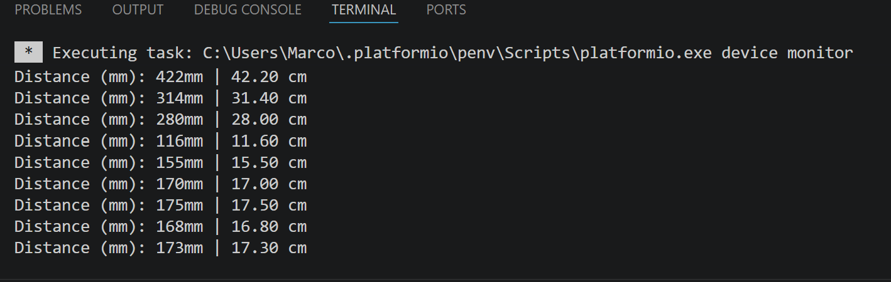
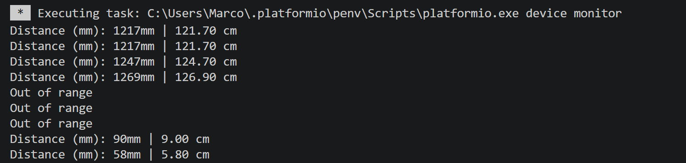

## June 12th

All parts came in. Assembled mechanical [chassis](https://github.com/marco-v9/DriveWire/blob/main/Chassis.md). 

## June 13th

Ran basic code on ESP32 board to show it is communicating properly with my computer over serial. 

## June 14th

Soldered dual motor driver board, and wired basic powertrain circuitry. Ran code to spin a motor, and touched two wires against contacts. Confirmed by doing so that the motor will go forward, and reverse based on the code written. 

## June 29th

Soldered 22 AWG automotive wire to the motor terminals, and wrapped joints in heat shrink wrap. Zip tied cables as needed to reduce strain on joints and keep good organization. 

Also soldered the current sensor board and time of flight sensor board. Soldered jumper wires to the battery pack with heat shrink at the joint for easy connection to power source. Battery pack secured to underside of chassis for lower centre of gravity, and breadboard mounted to top of chassis with adhesive. 

Wired up the full circuit minus the ToF sensor, and created much more in depth code that allows for user input in order to test circuit function. 

Ran into an issue where there was an audible buzzing, and no motor movement when expected with input. After some tinkering, I discovered that the PWM (pulse-width modulation) set at 90 was too low to overcome static friction, and the default frequency of 1kHz was causing the motor windings to vibrate and a frequency audible to the human ear. I adjusted the PWM duty value to 140 and this solved the issue. 

I now have a bug where one motor functions perfectly as expected, but the other is not responding to any inputs. I have two dual motor driver boards, so i tested between the two. I got slightly different results, but neither perfectly drove both motors. I still have to go through some more debugging, but at this point I am suspicious of the motor driver board. 

  

# July 1 - July 3
I learned SolidWorks with the goal of 3D printing a professional demo [support stand](https://github.com/marco-v9/DriveWire/blob/main/Mechanical/Support-Stand.md) for DriveWire. I need the wheels to be suspended off the ground so that I can debug and demo properly. By July 3rd, using reference planes, sketch tools, and the rib feature, along with basic structural analysis, this is the stand that I produced: 

  

Also sliced design, and started 3D printing process using black PLA on the Raise3D E2 printer. Supports off to avoid scarring small details, and a 9 hour estimated print time. 

# July 6
3D printer error occured, and print stopped early. I restarted the print and it is going well so far and is 83.5% complete. Here is an image of the progress: 

  

I noticed the bottom corners lifting slightly due to shrinkage during cooling. The part will likely be functional, but for future iterations I will explore solutions such as increased temperature on the heating bed (was 65 degrees for this print), use of brim, and other print settings to improve first layer adhesion. 

# July 7th
I was able to pick up the successful print for the stand: 

  

After testing, the chassis sits perfectly mounted on the stand and seems extremely stable. This will become the testbench where I can continue the debugging and bring-up process. Next step is to debug one motor not recieving power. 

# July 8th
Began debugging the issue where one motor isn't recieving power. 
Debugging extended video: [DriveWire V1 Debugging - Motor Power Issues](https://youtu.be/vDU9MoDfNq8?si=B3OYoYzJ7QpWY6p5)

During previous tests, I confirmed that both DC motors function correctly, and that the 22 AWG automotive wire and soldered motor terminal connections are not the source of the issue.

The suspected failure point was the dual motor driver board. To isolate the issue, I tested whether the fault followed the ESP32 control inputs or stayed with the motor driver output channel.

Before debugging, only the left motor was receiving power. However, its polarity was reversed relative to the firmware command.

First, I swapped the motor driver input signals. After this change, the left motor still ran, but its polarity changed. The right motor remained off. This suggested that the ESP32 control signals were not the main issue, since changing the input mapping affected the working motor but did not restore the inactive motor.

Next, I swapped the motor outputs. After swapping the outputs, the left motor no longer worked, while the right motor began working with reversed polarity. This confirmed that the fault stayed with one output channel of the motor driver board, rather than following the motor, wiring, or ESP32 control signals.

I inspected the driver board visually, but did not find any obvious solder bridges or damaged connections. The issue may be internal to the H-bridge or motor driver IC.

As a temporary workaround, I added the backup dual motor driver board. This second board also appears to have only one fully functional output channel, so each board is now driving one motor using its working channel. Both boards are powered from the same motor supply rail, which was approximately 6.24 V during testing, and both boards share a common ground with the ESP32.

With this setup, both wheels now spin correctly, and the forward, reverse, and pulse commands function as intended.

### New bug discovered: 
The turning commands are currently producing incorrect behavior.

For the right turn command, R, the left wheel spins backward, which suggests its polarity or logic is inverted. However, the right wheel also spins backward.

For the left turn command, L, the right wheel still spins backward, while the left wheel spins forward. The left wheel behavior appears to be an inverted polarity issue, but the right wheel not changing direction between L and R suggests that there may also be a firmware mapping or command logic issue.

The next debugging step is to verify the motor direction mapping in firmware and create a simple truth table for each command, showing the expected and actual direction of each wheel.

| Command | Expected Left | Expected Right | Actual Left | Actual Right |
| ------- | ------------- | -------------- | ----------- | ------------ |
| F       | forward       | forward        | forward     | forward      |
| B       | backward      | backward       | backward    | backward     |
| L       | backward      | forward        | forward     | backward     |
| R       | forward       | backward       | backward    | backward     |

# July 20th
I designed a first version of the schematic of the main battery power architecture in Altium for the first DriveWire custom PCB. 

  

Battery power comes in through the 2-pin screw terminal connector rated for 300 V and 12 A as per UL standards, with 20mOhm contact resistance. The negative terminal goes to ground and the positive terminal immediately goes to the main fuse. 

For now, I chose the 3568 Keystone fuse holder while planning on using a 5 A MINI Blade Fuse from Littelfuse, rated for 32 V DC. Here is the TCC curve from the spec sheet (looking at the 5 A curve): 

  

Then the fused battery voltage is fed into the drain of a AOD4185 PMOS. This MOSFET is being used for reverse polarity protection, if the battery were to be connected the wrong way. It works by connecting its gate to ground, so that if battery voltage is connected properly, it brings VD high, and allows current to flow through the transistor's body diode to bring up the voltage at the source, VS. As the source voltage increases via the body diode, |VGS| increases, which forms the low resistance channel allowing current to then properly flow through. If the battery was connected the wrong way initially, VD would be negative VBAT, and then the body diode would be reverse biased and no current would flow through to change VS. 

After the reverse polarity protection, I added one more AOD4185 PMOS for the main mechanical power switch. This is because the selected EG1218 slide switch is rated for only 200 mA at 30 VDC, so it is not suitable for carrying the several amps that the complete system could draw. Instead the mosfet handles the current and the SPDT switch controls gate biasing. When the SPDT switch is switched to ground, VGS is at its largest magnitude and the mosfet conducts current, however when the switch is switched to connect to the source, VGS is zero, and no current flows, shutting the circuit power off. 

I am currently considering adding the ability for the ESP32 WROOM module to shut down the main power electronically. 

Then we get to the main VBAT bus, which has just a bit under full battery voltage (with minor losses from the circuitry above), protected from major short circuit currents through the main fuse, reverse polarity connections through the reverse connected PMOS, and controlled by a main switch through a second PMOS. 

# July 23rd
Wired the ToF distance sensor board (VL53L1X board). 

  

Secured the sensor to the front of the chassis facing forward to detect objects in front of DriveWire. Used a temporary adhesive, which has the sensor secured in the appropriate position, however I am realizing a 3D printed bracket to hold the sensor board in the future would be a much more satisfying solution.

I will now begin working on the firmware to test the sensor. 

Later I finished writing a simple test file stored in the project as a .txt file under the TestFiles folder. It prints distance in both mm and cm over serial taking measurements at a frequency of 1 Hz. Here are some of the readings from the test run: 

  

I also tested the maximum range with the physical hardware: 

  

Under the tested indoor conditions and target surface, reliable readings were observed up to approximately 1.3 m. DriveWire should be able to brake in that distance if an object is detected in its path, though more testing will need to be done to confirm. 

A video of this process can be found [here](https://youtube.com/shorts/BkFgAW3W1bs?feature=share).
