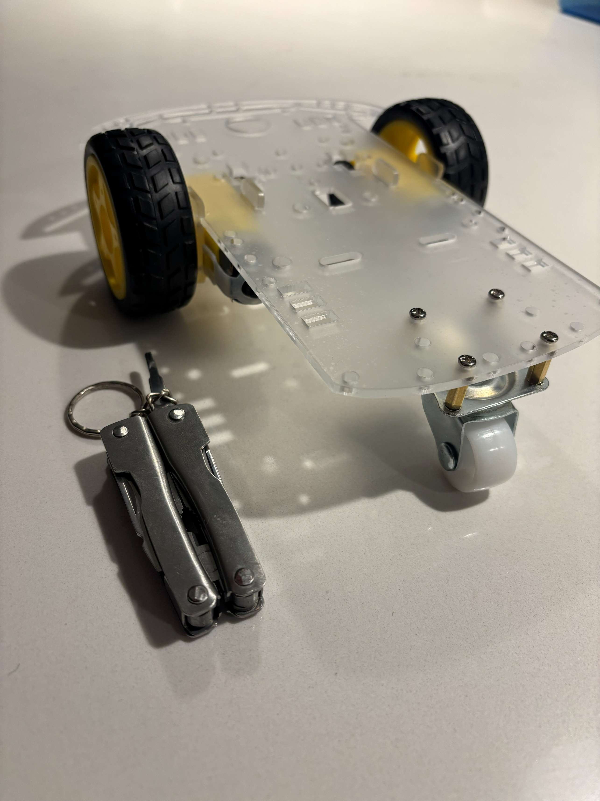

# Chassis Assembly

This is the most mechanical part of the system. Assembling the chassis included installing two DC motors to the chasis with fasteners and screws. Then adding the velocimetry code wheels, hammer caster (screwed on with spacers), and the outer wheels attached. 

  

Chassis as completely built. 
