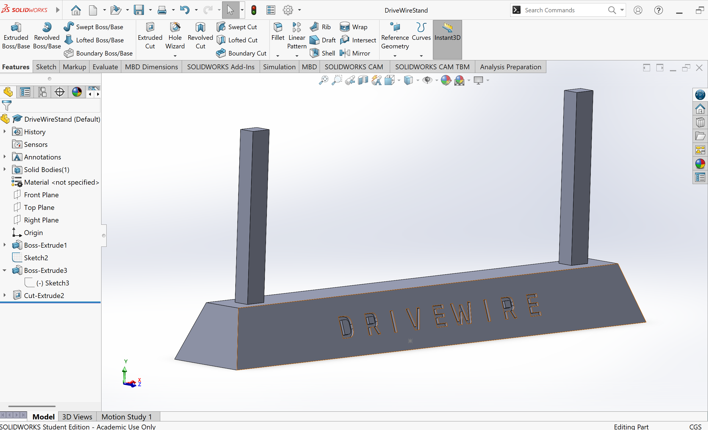
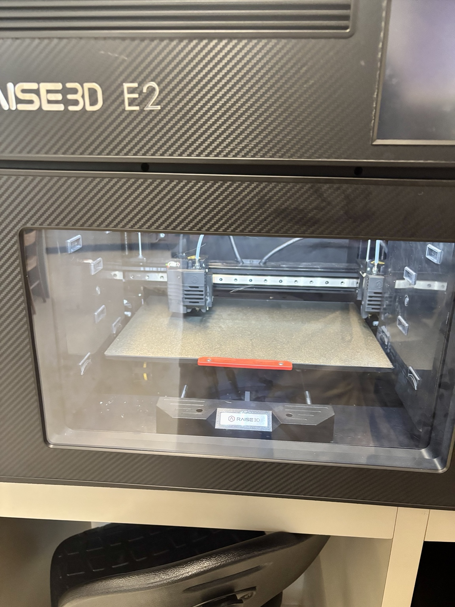

# Support Stand

This is the stand used to hold DriveWire for testing, keeping the wheels off the ground and supporting the chassis in a stable manner. 

I am creating this stand using SolidWorks Premium 2024, with intention of 3D printing the stand. This is my first time in a couple years using SolidWorks, however I feel very comfortable with largescale commercial CAD software and am adapting quickly. 

### Spin 1
On July 1st, I began modelling the stand. I got to this point: 

  

I believe I need to adjust the width of the two supports, as they will be under significant straign. I will try going from 0.8cm x 0.25cm to 0.8cm x 0.5cm in my next modelling session. I should probably fillet them as well for better sturdiness. 

Later on July 1st, I also added a custom DriveWire engraving onto the base of the stand, and increased the width of the supports to 0.8cm x 0.6cm for extra robustness. Here is the image of the updates:

  

### Spin 2
On July 2nd, I decided to widen the base and use four supports instead of two for extra sturdiness. I lowered the height of the base to 1.6 cm still at a 20 degree incline to save material without costing much stability (base is very wide, a bit of height is less relevant to stability). 

### Spin 3 (Final)
On July 3rd, I used reference planes to sketch and rib the top of each support. I need to confirm if the 3D printer will handle this ok, but this may be the final design: 

  

## 3D Printing
Sliced the .stl file of my stand, and chose supports off to hopefully avoid scaring the small details in the text and overhangs. 

Using black PLA, I began printing:

  

