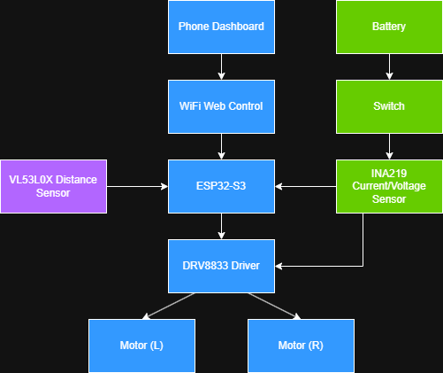
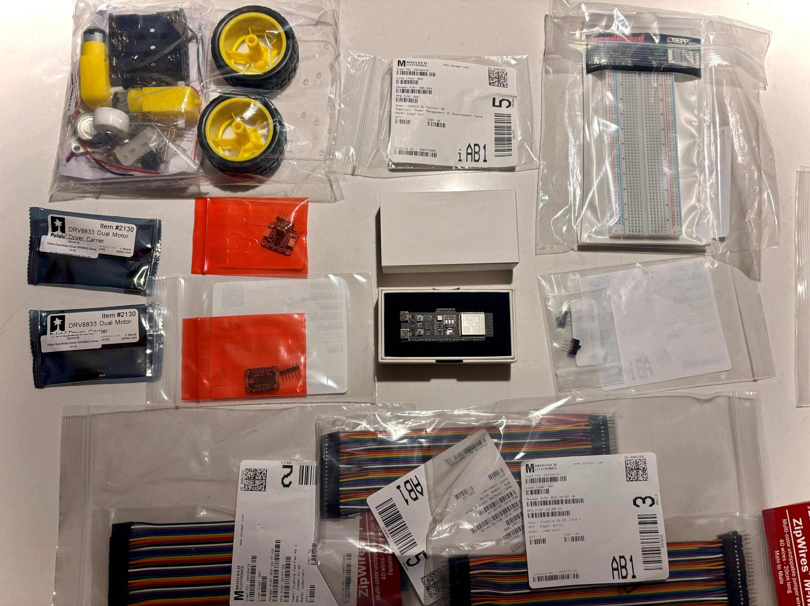

# DriveWire
## Wireless Mini EV Telemetry Platform

DriveWire V1 is a scaled down electric‑vehicle (EV) platform built to explore wireless telemetry, embedded firmware, and mechanical design. The goal is to create a self‑contained test bed that can collect vehicle data and transmit it wirelessly to a ground station for analysis in real time over WiFi. This repository contains both the hardware notes and the firmware for an ESP32‑S3 microcontroller that powers the vehicle’s on‑board electronics.

The project started from the need to rapidly prototype and test EV subsystems. A small chassis makes it easy to experiment with sensors, motor controllers and wireless communication without the cost and complexity of a full‑size vehicle. DriveWire V1 demonstrates how to integrate mechanical and electrical components, write embedded C++ firmware and configure a PlatformIO project.

## V1 Architecture

  

High-level architecture of the DriveWire V1 platform.

## Features

- Wireless telemetry: The ESP32‑S3 microcontroller streams sensor data over Wi‑Fi or serial, allowing live monitoring of speed, battery voltage, voltage sag, motor inrush and current draw, estimated power, acceleration, distance, and other parameters.
- Mini EV chassis: Two DC motors mounted to the chassis provide propulsion. A rear hammer caster and code wheels for velocimetry complete the drivetrain assembly.
- Modular firmware: The code is structured as a PlatformIO project with separate src and include directories. It uses the Arduino framework for rapid development.
- Test scaffolding: A test directory is included for future unit tests using PlatformIO’s built‑in testing framework.
- Cross‑platform build: The platformio.ini file targets the esp32‑s3‑devkitc‑1 board with configurable upload and monitor ports.

## Hardware (V1)

| Component | Purpose |
|------------|------------|
| ESP32-S3 DevKitC-1 N8R8 | Main microcontroller |
| TB6612FNG Motor Driver | Controls left and right motors |
| 2x DC Gear Motors | Vehicle propulsion |
| 4x AA Battery Pack | Motor power source |
| USB Power Bank | ESP32 power source |
| Chassis Kit | Mechanical platform |
| Misc Sensors | Current, voltage, distance sensing |

  

Some components for the inital V1 build (exluding tools). 

## Current V1 Scope
The first version focuses on building a reliable 2WD rover with phone/browser control and basic telemetry.

Included in V1
- ESP32-S3 microcontroller
- Dual DC motor control
- PWM speed control
- Wi-Fi-based control interface
- Battery voltage monitoring
- Current sensing
- Estimated power calculation
- Distance sensing
- Fault handling logic
- Clean wiring and documentation

Not included in V1
- Camera
- Autonomous driving
- BLDC motor control
- Custom PCB

Those may be explored in later versions after the first prototype works reliably.

## Software Features

Motor Control
- Forward
- Reverse
- Left turn
- Right turn
- Stop
- PWM speed control

Telemetry
- Battery voltage (and voltage sag)
- Current draw (incl. motor inrush)
- Estimated power
- PWM duty cycle
- Distance sensor data (acceleration, speed, distance)
- System state
- Fault state
- Fault Handling

DriveWire includes a basic embedded fault state machine.

Planned states:

NORMAL

WARNING

FAULT

SAFE_SHUTDOWN

Example fault conditions:

Low battery voltage

Overcurrent event

Communication timeout

Emergency stop
Invalid control command
